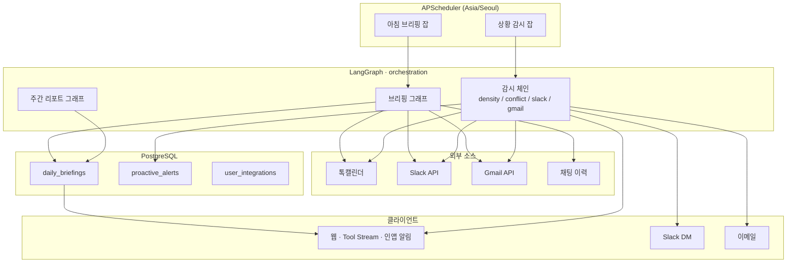

# Moneo

[](https://nextjs.org/)
[](https://react.dev/)
[](https://www.typescriptlang.org/)
[](https://tailwindcss.com/)
[](https://fastapi.tiangolo.com/)
[](https://www.postgresql.org/)
[](https://langchain-ai.github.io/langgraph/)
[](https://api.slack.com/)
[](https://developers.google.com/gmail/api)
[](https://neo4j.com/)
[](https://vercel.com/)
[](./docker-compose.yaml)

**AI Agents, Orchestrated for Work** — 일정·채팅·Slack·Gmail을 모아 매일 브리핑하고, 업무 중 이상 징후를 능동적으로 알려 주는 웹 앱입니다.

LangGraph로 **수집 → 합성 → 검증** 파이프라인을 돌리고, 검증 실패 시 재시도와 Human-in-the-loop를 지원합니다. 프론트는 Vercel, API는 Docker + Cloudflare Tunnel로 운영 중입니다.

> 상세 현황: [`docs/PROJECT_STATUS.md`](./docs/PROJECT_STATUS.md) · 설계 설명: [`docs/ARCHITECTURE.md`](./docs/ARCHITECTURE.md)

---

## Demo

**Live:** [https://www.monenon.cloud](https://www.monenon.cloud)

<!-- 스크린샷 / GIF를 `docs/assets/` 에 넣은 뒤 아래 주석을 해제하세요.


-->

```text
┌──────────────────────────────────────────────┐
│  [ Screenshot / GIF placeholder ]            │
│  docs/assets/demo-home.png                   │
│  docs/assets/demo-tool-stream.gif            │
└──────────────────────────────────────────────┘
```

API: `https://api.monenon.cloud` · Auth: `https://auth.monenon.cloud`

---

## 핵심 기능 (구현됨)

- **일일 업무 브리핑** — LangGraph (`router → calendar → docs → history → slack → gmail → synthesizer → validator`). 미연동 소스는 `skipped`로 넘어가고, validator 실패 시 synthesizer 최대 2회 재시도. Tool Stream에 재시도·검증이 노출됩니다.
- **상황 감지형 능동 알림** — APScheduler(~30분)로 일정 밀집/겹침·Slack 긴급·Gmail 데드라인 감지. `proactive_alerts`로 24시간 중복 억제. Slack DM / 이메일 / 인앱 벨.
- **채팅 의도 라우팅** — `/agent/chat`이 `briefing_request` / `report_request` / `general_chat`으로 분류해 브리핑·주간 리포트 그래프 또는 Gemini 일반 대화로 연결.
- **Human-in-the-loop** — 브리핑 validator가 `pending_review`로 넘기면 채팅 UI에서 포함/제외 결정.
- **주간 리포트** — 최근 7일 `daily_briefings`를 집계하는 별도 LangGraph 서브플로우.

**완성도 스냅샷** (코드 기준, 과장 없음)

| 영역 | 상태 |
|------|------|
| 브리핑 그래프 + Tool Stream | ✅ |
| Slack / Gmail / 톡캘린더 연동 | ✅ |
| Watcher + 인앱 알림 | ✅ (인앱만 쓰는 사용자용 Watcher 게이트는 개선 여지) |
| Docs 스토어 | ⬜ 스텁 (`skipped`) |
| Validator eval | ✅ 15/15 (2026-08-13) |

---

## 아키텍처

브리핑 파이프라인:

```text
router → calendar → docs → history → slack → gmail → synthesizer ⇄ validator
                                                              (max 2 retries)
```

전체 데이터 흐름 (`docs/ARCHITECTURE.md`와 동일):



---

## 기술 스택

| 구분 | 기술 |
|------|------|
| **프론트** | Next.js 16 (App Router), React 19, TypeScript, Tailwind CSS 4 — `frontend/` |
| **백엔드** | Python 3.13+, FastAPI, Uvicorn, SQLAlchemy 2 (async), Alembic — `backend/apps/` |
| **에이전트** | LangGraph, Google Gemini, APScheduler |
| **연동** | Slack API (OAuth · digest · DM), Gmail API (OAuth · 미읽음 · 메일 발송), 카카오 톡캘린더 |
| **데이터** | PostgreSQL (+ pgvector 서비스). Neo4j는 Compose에 포함되나 **브리핑 코어 비의존** (교육/허브 모듈용) |
| **인프라** | 프론트 **Vercel** · API/Auth **Docker Compose + Cloudflare Tunnel** |
| **인증** | 카카오 · 네이버 · Google OAuth |

---

## 로컬 실행

### 사전 준비

- Node.js 20+, npm
- Python 3.13+ (또는 Docker만 사용)
- `backend/.env`, `frontend/.env` — 샘플은 `backend/.env.example`, 루트 `.env.example`

### 옵션 A — Docker (API + DB)

```bash
docker compose up --build backend pgvector
# API: http://127.0.0.1:8000/docs
```

### 옵션 B — 백엔드 uvicorn

```bash
cd backend
# venv 활성화 후
cd apps && uvicorn main:app --reload --port 8000
```

### 프론트

```bash
cd frontend
npm install
npm run dev
# http://127.0.0.1:3000
```

`NEXT_PUBLIC_API_BASE_URL`이 로컬/배포 API를 가리키는지 확인하세요.

---

## 프로젝트 구조

```text
monenon.cloud/
├── frontend/                 # Next.js 웹 (Vercel)
│   ├── app/                  # App Router 페이지
│   ├── components/           # UI · Tool Stream · 마이페이지
│   └── lib/                  # API 클라이언트 · OAuth
├── backend/
│   ├── apps/
│   │   ├── main.py           # FastAPI 엔트리
│   │   ├── orchestration/    # 브리핑 · Watcher · 연동 · 채팅
│   │   ├── secretary/        # 계정 · OAuth
│   │   └── …                 # 교육/실험 시블링 앱
│   ├── alembic/              # 마이그레이션
│   └── Dockerfile
├── docs/
│   ├── ARCHITECTURE.md
│   ├── PROJECT_STATUS.md
│   └── validator_eval_results.md
├── scripts/                  # eval · 배포 보조
└── docker-compose.yaml
```

---

## 더 보기

| 문서 | 내용 |
|------|------|
| [PROJECT_STATUS.md](./docs/PROJECT_STATUS.md) | 기능별 구현/미구현 · 파일 경로 |
| [ARCHITECTURE.md](./docs/ARCHITECTURE.md) | 설계 결정 · 스케줄러 · 테이블 |
| [validator_eval_results.md](./docs/validator_eval_results.md) | Validator 평가 15/15 |

---

## License

Private / proprietary unless otherwise noted.
