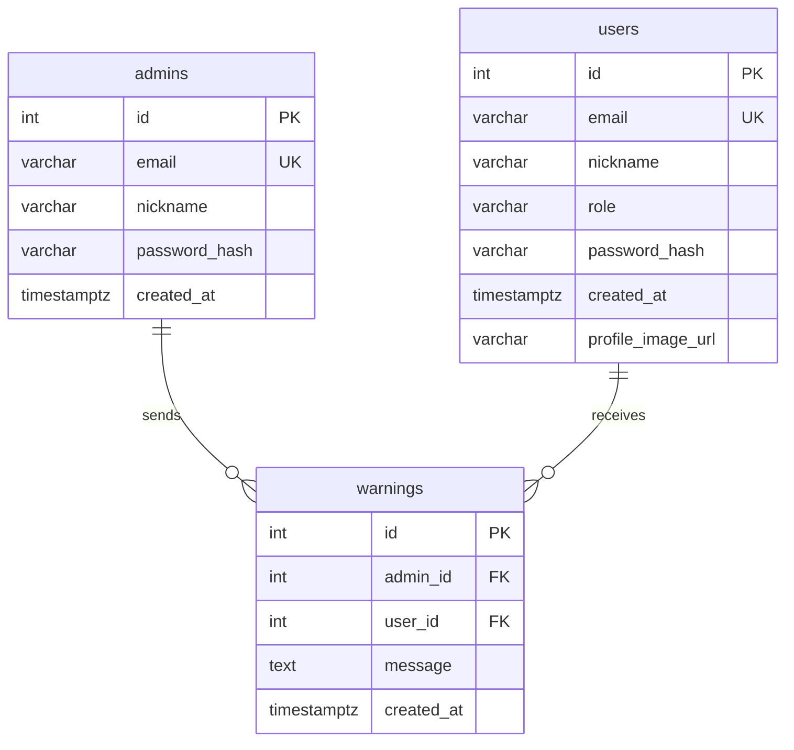

# Admin ERD

> **적용 범위:** `backend/apps/admin/`  
> **관련 규칙:** [`ENTITY_RULE.md`](ENTITY_RULE.md), [`BACKEND_RULES.md`](BACKEND_RULES.md)  
> **연관 도메인:** 일반 회원 `users` (`backend/apps/secretary/adapter/outbound/orm/user_model.py`)  
> **플랫폼 ERD:** [`LIFESTYLE_ERD.md`](LIFESTYLE_ERD.md) — 유저 중심 플랫폼 ERD + 관리자·`warnings` 교차

관리자 모듈은 `backend/apps/admin/` 에 있으며, 일반 `/login`·`users` 관리자 행과 **분리**됩니다.

---

## 코드 위치

| 구분 | 경로 |
|------|------|
| 앱 모듈 | `backend/apps/admin/` |
| ORM | `admin/adapter/outbound/orm/admin_account.py`, `warning.py` |
| API | `admin/adapter/inbound/` → `main.py`의 admin 라우터 |
| UI | `frontend/app/admin/` |

---

## 제품 역할

| 기능 | 설명 | API 예 |
|------|------|--------|
| **관리자 로그인** | 고정 계정 1명 (`admin@gmail.com`) | `POST /admin/login` → `admin_access_token` |
| **회원 목록·조회** | `users` 테이블 일반 회원 | `GET /admin/users`, `/members` |
| **회원 탈퇴** | 일반 회원 삭제 | `DELETE /admin/users/{id}` |
| **경고** | 관리자 → 회원 경고 (`warnings` 교차 테이블) | `POST /admin/users/{id}/warnings` |

---

## ERD (Mermaid) — 교차 엔티티 `warnings`



`admins`와 `users`는 **서로 FK가 없고**, `warnings`가 둘을 연결합니다.

---

## 관계

| 부모 | 자식 | 카디널리티 | 설명 |
|------|------|-----------|------|
| `admins` | `warnings` | 1 : N | 발신 (`admin_id`) |
| `users` | `warnings` | 1 : N | 수신 (`user_id`, 일반 회원만) |

---

## `users.role` vs `admins`

| 항목 | `admins` | `users` (`role`) |
|------|----------|------------------|
| 용도 | **실제** 관리자 로그인·관리 UI | 일반 회원 (`user`) |
| 관리자 계정 | `admin@gmail.com` 여기만 | `role=admin` 레거시 — 시작 시 **삭제** |

---

## 테이블 정의

### `admins` — 시스템 관리자

| 컬럼 | 타입 | 제약 | 설명 |
|------|------|------|------|
| `id` | int | PK, autoincrement | 관리자 PK (시드 시 1 기대) |
| `email` | varchar(255) | UNIQUE | `admin@gmail.com` |
| `nickname` | varchar(32) | NOT NULL | 표시 이름 |
| `password_hash` | varchar(255) | NOT NULL | 비밀번호 해시 |
| `created_at` | timestamptz | NULL | 생성 시각 |

### `warnings` — 경고 (교차)

| 컬럼 | 타입 | 제약 | 설명 |
|------|------|------|------|
| `id` | int | PK, autoincrement | 경고 PK |
| `admin_id` | int | FK → `admins.id`, CASCADE, index | 발신 관리자 |
| `user_id` | int | FK → `users.id`, CASCADE, index | 대상 회원 |
| `message` | text | NOT NULL | 경고 내용 |
| `created_at` | timestamptz | NULL | 발송 시각 |

레거시 테이블 `user_warnings`는 시작 시 `warnings`로 rename 됩니다.

---

## 구현 상태

| 항목 | 구현 |
|------|------|
| 시작 시드 | `main.py` lifespan → `AdminService.ensure_admin_account()` |
| 테이블 마이그레이션 | `user_warnings` → `warnings`, `admin_id` 컬럼 추가·백필 |
| 인증 | `POST /admin/login` |
| 회원 API | `/admin/users/*` |

---

## Cursor 고정 명령어

```text
@docs/DevOps/backend/ADMIN_ERD.md @docs/DevOps/backend/LIFESTYLE_ERD.md

warnings = admins(admin_id) ↔ users(user_id) 교차. 테이블명 warnings (구 user_warnings).
```
