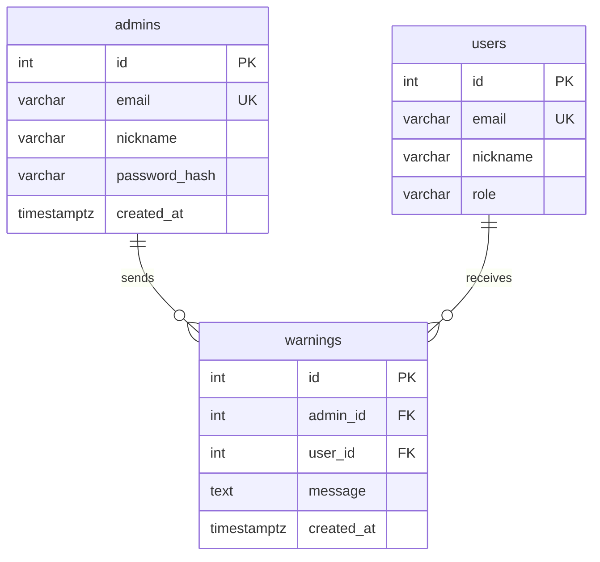

# Lifestyle · Platform ERD

> **적용 범위:** `backend/apps/lifestyle/adapter/outbound/orm/`, `backend/apps/admin/adapter/outbound/orm/`  
> **관련 규칙:** [`ENTITY_RULE.md`](ENTITY_RULE.md), [`BACKEND_RULES.md`](BACKEND_RULES.md)  
> **외부 참조:** `users` (`backend/apps/secretary/adapter/outbound/orm/user_model.py`)  
> **관리자 상세:** [`ADMIN_ERD.md`](ADMIN_ERD.md)  
> **매핑 철학:** [`moneyball.casting.md`](../../backend/apps/moneyball/_docs/moneyball.casting.md) §4와 동일 — **문서 ERD = 물리 FK**

Mermaid `erDiagram`은 **`||--||` `||--o{` `||--o|`** 만 사용합니다 (`}o--||` 는 Obsidian에서 선이 안 그려짐).

---

## 스키마 매핑 규칙 (필수 — 하네스 결정)

`ENTITY_RULE`: 신규·기존 플랫폼 테이블 PK는 **`id` int 자동증감**만. 복합·문자열 PK 금지.

**채택 모델 (유저 중심 — 임의 변경 금지):**

| 물리 테이블 | PK | 소유·FK | 카디널리티 |
|-------------|----|---------|-----------|
| `users` | `id` | — | 허브 |
| `user_settings` | `id` | `user_id` → `users.id` **UNIQUE** | users 1—1 |
| `closet` | `id` | `user_id` → `users.id` **UNIQUE** | users 1—1 (취향 프로필) |
| `music` | `id` | `user_id` → `users.id` **UNIQUE** | users 1—1 (취향 프로필) |
| `refrigerator` | `id` | `user_id` → `users.id` **UNIQUE** | users 1—1 (취향 프로필) |
| `closet_items` | `id` | `user_id` → `users.id` | users 1—N (보유 목록) |
| `music_items` | `id` | `user_id` → `users.id` | users 1—N |
| `refrigerator_items` | `id` | `user_id` → `users.id` | users 1—N |
| `chat_sessions` | `id` | `user_id` → `users.id` | users 1—N |
| `messages` | `id` | `session_id` → `chat_sessions.id` | sessions 1—N |
| `admins` | `id` | — (users와 FK 없음) | 시드 1행 |
| `warnings` | `id` | `admin_id` → `admins.id`, `user_id` → `users.id` | 교차 |

- **프로필 vs 목록:** `closet` / `music` / `refrigerator`는 유저당 취향 **1장**. `*_items`는 같은 유저의 **실물·저장 목록**. 둘 다 `users` 직속.
- **금지:** `closet_id` / `music_id` / `refrigerator_id`를 아이템에 두지 않는다. (헤더가 유저당 1행이라 중간 FK 이득 없음)
- **다이어그램 = 물리 FK.** UI에서 “옷장 화면”으로 묶여 보여도 ERD 선은 `users → *_items`다.
- ERD에 없는 컬럼·벡터 차원을 추측으로 추가하지 않는다.

충돌 시 우선순위: **`ENTITY_RULE` → 본 매핑표 → 기존 ORM** (`lifestyle_orm.py`, `chat_orm.py`).

---

## 데이터 · 화면 · 역할 매칭 (최종)

| 구분 | 화면명 (UI) | 주 데이터 테이블 | 핵심 역할 |
|------|-------------|------------------|-----------|
| **개인 영역** | 마이페이지 (`/mypage`) | `users` | 본인 정보 확인·프로필 사진 변경·가입 정보 |
| **운영 영역** | 회원 관리 (`/admin`) | `users` | 관리자 — 회원 전수 조회·**경고**·탈퇴 |
| **운영 영역** | 사용자 설정 조회 (`/admin/user-settings`) | `user_settings` | 관리자 — 회원별 AI 모델·언어 등 앱 설정 조회 |

동일 `users` 테이블이 **마이페이지(개인)** 와 **회원 관리(운영)** 에서 역할만 다르게 쓰입니다.  
`user_settings`는 **사용자 설정 조회** 전용이며, 회원 계정·경고와는 분리합니다.

---

## 제품 도메인 (테이블 이름과 다를 수 있음)

| UI·기능 | 역할 | DB 테이블 |
|---------|------|-----------|
| **마이페이지** | 본인 정보·프로필 (`/mypage`) | `users` |
| **회원 관리** | 관리자 — 조회·경고·탈퇴 (`/admin`) | `users` |
| **사용자 설정 조회** | 관리자 — AI 모델·언어 등 앱 설정 | `user_settings` (`user_id`) |
| **선호도 설정** | 평소 스타일·음악 취향·기피 재료 | `closet`, `music`, `refrigerator` (각 `user_id` UNIQUE) |
| **옷장** | 날씨·체감온도 복장 추천 | `closet` + `closet_items` (둘 다 `users` 직속) |
| **음악** | 날씨·상황 음악 추천 | `music` + `music_items` (둘 다 `users` 직속) |
| **냉장고** | 채팅 음식 추천·유통기한 안내 | `refrigerator` + `refrigerator_items` + `chat_sessions` → `messages` |
| **관리자 계정** | `/admin/login` (`admin_access_token` 분리) | `admins` → `warnings` ← `users` |

---

## 대시보드 카테고리 ↔ ERD

| 카테고리 | 테이블 | 설명 |
|----------|--------|------|
| **관리자** | `admins`, `warnings` | `/admin` 로그인·경고 발송 |
| **회원·운영** | `users` | 마이페이지(개인) · 회원 관리(운영) |
| **사용자 설정 조회** | `user_settings` | 관리자 — AI 모델·언어 등 앱 설정 |
| **취향 프로필** | `closet`, `music`, `refrigerator` | 유저당 1행 — 스타일·장르·기피 재료 |
| **보유·저장 목록** | `closet_items`, `refrigerator_items`, `music_items` | 유저 직속 N행 — 의류·식재료·저장곡 |
| **채팅** | `chat_sessions` → `messages` | 대화 (냉장고·음식 추천 등에 사용) |

---

## ERD — 회원·앱 설정 (`users` + `user_settings`)

```mermaid
erDiagram
    users ||--|| user_settings : app_and_ai

    users {
        int id PK
        varchar email UK
        varchar nickname
        varchar role
        varchar password_hash
        timestamptz created_at
        varchar profile_image_url
    }

    user_settings {
        int id PK
        int user_id FK UK
        varchar language
        varchar preferred_model
        timestamptz created_at
        timestamptz updated_at
    }
```

---

## ERD — 관리자 (`admins` · `warnings` · `users`)

`warnings`가 **admins ↔ users 교차 엔티티**입니다.



| 기능 | API |
|------|-----|
| 관리자 로그인 | `POST /admin/login` |
| 회원 목록·탈퇴 | `GET/DELETE /admin/users/*` |
| 경고 발송 | `POST /admin/users/{id}/warnings` |
| 사용자 설정 조회 | `GET /admin/user-settings` |
| 경고 조회 (회원) | `GET /auth/warnings` |

코드: `backend/apps/admin/`, UI: `frontend/app/admin/`

---

## ERD — 라이프스타일 · 채팅 (유저 중심)

모든 취향 프로필·보유 목록·채팅 세션의 부모는 **`users`**.  
`closet` ↔ `closet_items` 사이에는 **DB FK가 없다** (같은 `user_id`로 조인·화면 묶음만).

```mermaid
erDiagram
    users ||--|| closet : taste_outfit
    users ||--|| music : taste_music
    users ||--|| refrigerator : taste_food
    users ||--o{ closet_items : owns_clothes
    users ||--o{ music_items : owns_tracks
    users ||--o{ refrigerator_items : owns_stock
    users ||--o{ chat_sessions : chats
    chat_sessions ||--o{ messages : messages

    closet {
        int id PK
        int user_id FK UK
        varchar gender_preset
        json style_tags
        varchar temperature_sensitivity
        timestamptz created_at
        timestamptz updated_at
    }

    closet_items {
        int id PK
        int user_id FK
        varchar name
        varchar category
        varchar warmth
        varchar color
        varchar note
        timestamptz created_at
    }

    refrigerator {
        int id PK
        int user_id FK UK
        json avoided_ingredients
        json cooking_preference_tags
        timestamptz created_at
        timestamptz updated_at
    }

    refrigerator_items {
        int id PK
        int user_id FK
        varchar name
        varchar quantity
        date expiry_date
        varchar category
        varchar note
        timestamptz created_at
    }

    music {
        int id PK
        int user_id FK UK
        json genre_tags
        json mood_tags
        timestamptz created_at
        timestamptz updated_at
    }

    music_items {
        int id PK
        int user_id FK
        varchar title
        varchar artist
        varchar scene
        varchar note
        timestamptz created_at
    }

    chat_sessions {
        int id PK
        int user_id FK
        varchar title
        timestamptz created_at
        timestamptz updated_at
    }

    messages {
        int id PK
        int session_id FK
        varchar role
        text content
        timestamptz created_at
    }
```

### 프로필 vs 목록 (같은 유저, 다른 층)

| 기능 | 취향 프로필 (`user_id` UNIQUE) | 보유·저장 목록 (`user_id` N) |
|------|-------------------------------|------------------------------|
| 옷장 | `closet` — 스타일 태그, 체감온도 | `closet_items` — 보유 의류 → **날씨 맞춤 추천** |
| 음악 | `music` — 장르·무드 | `music_items` — 저장곡 → **날씨·상황 추천** |
| 냉장고 | `refrigerator` — 기피·알레르기·요리 성향 | `refrigerator_items` — 재고·유통기한 → **채팅 추천·만료 알림** |

앱에서 추천할 때: **같은 `user_id`로** 프로필 JSON + 아이템 목록을 함께 읽는다.

---

## 관계

### 앱·AI 설정

| 부모 | 자식 | 카디널리티 | 설명 |
|------|------|-----------|------|
| `users` | `user_settings` | 1 : 1 | UI 언어, 선호 AI 모델 |

### `users` 직속 — 취향 프로필 (1:1)

| 부모 | 자식 | 카디널리티 | 제품 의미 |
|------|------|-----------|-----------|
| `users` | `closet` | 1 : 1 | 선호 복장·체감온도 |
| `users` | `music` | 1 : 1 | 선호 장르·무드 |
| `users` | `refrigerator` | 1 : 1 | 기피·알레르기·요리 성향 |

### `users` 직속 — 목록·채팅 (1:N)

| 부모 | 자식 | 카디널리티 | 제품 의미 |
|------|------|-----------|-----------|
| `users` | `closet_items` | 1 : N | 등록 의류 |
| `users` | `music_items` | 1 : N | 상황별 저장곡 |
| `users` | `refrigerator_items` | 1 : N | 유통기한·재고 |
| `users` | `chat_sessions` | 1 : N | 채팅방 |
| `chat_sessions` | `messages` | 1 : N | 대화 (`session_id`) |

### 물리 FK (= 다이어그램)

| 테이블 | 물리 FK | 다이어그램 부모 |
|--------|---------|-----------------|
| `user_settings` | `user_id` → `users.id` | `users` |
| `closet` / `music` / `refrigerator` | `user_id` → `users.id` | `users` |
| `closet_items` / `music_items` / `refrigerator_items` | `user_id` → `users.id` | `users` |
| `chat_sessions` | `user_id` → `users.id` | `users` |
| `messages` | `session_id` → `chat_sessions.id` | `chat_sessions` |
| `admins` | — | (독립) |
| `warnings` | `admin_id` → `admins.id`, `user_id` → `users.id` | `admins` + `users` |

### 관리자

| 부모 | 자식 | 카디널리티 | 설명 |
|------|------|-----------|------|
| — | `admins` | 1행 (시드) | `admin@gmail.com`, `/admin/login` |
| `admins` | `warnings` | 1 : N | 발신 (`admin_id`) |
| `users` | `warnings` | 1 : N | 수신 (`user_id`) |

---

## 테이블 정의

### `users` — 회원 (secretary)

| 컬럼 | 타입 | 제약 | 설명 |
|------|------|------|------|
| `id` | int | PK, autoincrement | 시스템 내부 PK |
| `email` | varchar(255) | UNIQUE | 로그인 이메일 |
| `nickname` | varchar(32) | NOT NULL | 표시 이름 |
| `role` | enum | NOT NULL | `user` 권장 (`admin`은 레거시, `admins` 테이블 사용) |
| `password_hash` | varchar(255) | NOT NULL | 비밀번호 해시 |
| `created_at` | timestamptz | NULL | 가입 시각 |
| `profile_image_url` | varchar(512) | NULL | 프로필 이미지 |

### `user_settings` — 사용자 설정 조회 (AI·언어 설정)

| 컬럼 | 타입 | 제약 | 설명 |
|------|------|------|------|
| `id` | int | PK, autoincrement | 시스템 내부 PK |
| `user_id` | int | FK → `users.id`, UNIQUE, CASCADE | 소유 사용자 |
| `language` | varchar(16) | NOT NULL, default `ko` | UI·응답 언어 |
| `preferred_model` | varchar(64) | default `gemini-2.5-flash-lite` | 선호 Gemini 모델 |
| `created_at` | timestamptz | server default NOW() | 생성 시각 |
| `updated_at` | timestamptz | on update | 수정 시각 |

### `closet` — 취향 프로필(복장)

| 컬럼 | 타입 | 제약 | 설명 |
|------|------|------|------|
| `id` | int | PK, autoincrement | 시스템 내부 PK |
| `user_id` | int | FK → `users.id`, UNIQUE, CASCADE | 소유 사용자 |
| `gender_preset` | varchar(16) | NOT NULL, default `unisex` | `male`, `female`, `unisex` |
| `style_tags` | json | NULL | 평소 선호 스타일 태그 |
| `temperature_sensitivity` | varchar(16) | NOT NULL, default `normal` | 체감온도 (날씨 추천용) |
| `created_at` | timestamptz | server default | 생성 시각 |
| `updated_at` | timestamptz | on update | 수정 시각 |

### `closet_items` — 보유 의류 (`users` 직속)

| 컬럼 | 타입 | 제약 | 설명 |
|------|------|------|------|
| `id` | int | PK, autoincrement | 시스템 내부 PK |
| `user_id` | int | FK → `users.id`, CASCADE, index | 소유 사용자 (**closet_id 없음**) |
| `name` | varchar(64) | NOT NULL | 의류 이름 |
| `category` | varchar(32) | default `top` | `top`, `bottom`, `outer` 등 |
| `warmth` | varchar(16) | default `mid` | `light`, `mid`, `heavy` |
| `color` | varchar(32) | NULL | 색상 |
| `note` | varchar(128) | NULL | 메모 |
| `created_at` | timestamptz | server default | 생성 시각 |

### `refrigerator` — 취향 프로필(식단·기피)

| 컬럼 | 타입 | 제약 | 설명 |
|------|------|------|------|
| `id` | int | PK, autoincrement | 시스템 내부 PK |
| `user_id` | int | FK → `users.id`, UNIQUE, CASCADE | 소유 사용자 |
| `avoided_ingredients` | json | NULL | 못 먹는·알레르기 재료 |
| `cooking_preference_tags` | json | NULL | 요리 성향 태그 |
| `created_at` | timestamptz | server default | 생성 시각 |
| `updated_at` | timestamptz | on update | 수정 시각 |

### `refrigerator_items` — 재고·유통기한 (`users` 직속)

| 컬럼 | 타입 | 제약 | 설명 |
|------|------|------|------|
| `id` | int | PK, autoincrement | 시스템 내부 PK |
| `user_id` | int | FK → `users.id`, CASCADE, index | 소유 사용자 (**refrigerator_id 없음**) |
| `name` | varchar(64) | NOT NULL | 식재료 이름 |
| `quantity` | varchar(32) | NULL | 수량 표기 |
| `expiry_date` | date | NULL, index | 유통기한 |
| `category` | varchar(32) | NULL | 분류 |
| `note` | varchar(128) | NULL | 메모 |
| `created_at` | timestamptz | server default | 생성 시각 |

### `music` — 취향 프로필(장르·무드)

| 컬럼 | 타입 | 제약 | 설명 |
|------|------|------|------|
| `id` | int | PK, autoincrement | 시스템 내부 PK |
| `user_id` | int | FK → `users.id`, UNIQUE, CASCADE | 소유 사용자 |
| `genre_tags` | json | NULL | 선호 장르 |
| `mood_tags` | json | NULL | 선호 무드 |
| `created_at` | timestamptz | server default | 생성 시각 |
| `updated_at` | timestamptz | on update | 수정 시각 |

### `music_items` — 저장 곡 (`users` 직속)

| 컬럼 | 타입 | 제약 | 설명 |
|------|------|------|------|
| `id` | int | PK, autoincrement | 시스템 내부 PK |
| `user_id` | int | FK → `users.id`, CASCADE, index | 소유 사용자 (**music_id 없음**) |
| `title` | varchar(128) | NOT NULL | 곡 제목 |
| `artist` | varchar(64) | NULL | 아티스트 |
| `scene` | varchar(16) | NOT NULL, default `commute`, index | `commute`, `outing`, `cooking` 등 |
| `note` | varchar(128) | NULL | 메모 |
| `created_at` | timestamptz | server default | 생성 시각 |

### `chat_sessions` — 채팅 세션

| 컬럼 | 타입 | 제약 | 설명 |
|------|------|------|------|
| `id` | int | PK, autoincrement | 시스템 내부 PK |
| `user_id` | int | FK → `users.id`, CASCADE, index | 소유 사용자 |
| `title` | varchar(128) | default `새 대화` | 세션 제목 |
| `created_at` | timestamptz | server default | 생성 시각 |
| `updated_at` | timestamptz | on update | 수정 시각 |

### `messages` — 메시지

| 컬럼 | 타입 | 제약 | 설명 |
|------|------|------|------|
| `id` | int | PK, autoincrement | 시스템 내부 PK |
| `session_id` | int | FK → `chat_sessions.id`, CASCADE, index | 소속 세션 |
| `role` | enum | NOT NULL | `user`, `assistant`, `system` |
| `content` | text | NOT NULL | 메시지 본문 |
| `created_at` | timestamptz | server default | 생성 시각 |

### `admins` — 시스템 관리자

| 컬럼 | 타입 | 제약 | 설명 |
|------|------|------|------|
| `id` | int | PK, autoincrement | 관리자 PK (시드 시 1 기대) |
| `email` | varchar(255) | UNIQUE | `admin@gmail.com` |
| `nickname` | varchar(32) | NOT NULL | 표시 이름 |
| `password_hash` | varchar(255) | NOT NULL | 비밀번호 해시 |
| `created_at` | timestamptz | NULL | 생성 시각 |

### `warnings` — 경고 (`admins` → `users` 교차)

| 컬럼 | 타입 | 제약 | 설명 |
|------|------|------|------|
| `id` | int | PK, autoincrement | 경고 PK |
| `admin_id` | int | FK → `admins.id`, CASCADE, index | 발신 관리자 |
| `user_id` | int | FK → `users.id`, CASCADE, index | 대상 회원 |
| `message` | text | NOT NULL | 경고 내용 |
| `created_at` | timestamptz | NULL | 발송 시각 |

---

## 구현 상태

| 항목 | 구현 |
|------|------|
| ORM | `lifestyle/adapter/outbound/orm/lifestyle_orm.py`, `chat_orm.py` |
| 회원 | `secretary/adapter/outbound/orm/user_model.py` |
| 관리자 | `admin/adapter/outbound/orm/` |
| API | lifestyle·chat·admin 라우터 (`/admin/login`, `/admin/users/*` 등) |
| 관리자 시드 | lifespan → 관리자 계정 ensure |

ORM은 이미 유저 중심 FK와 일치한다. **스키마 마이그레이션 불필요** (문서·ERD만 정합).

---

## Cursor 고정 명령어

```text
@vault/backend/LIFESTYLE_ERD.md @vault/backend/ENTITY_RULE.md

유저 중심: closet/music/refrigerator(1:1)와 *_items(1:N) 모두 user_id → users.
헤더→아이템 FK 없음. 다이어그램 = 물리 FK. admin: admins + warnings 교차.
```
