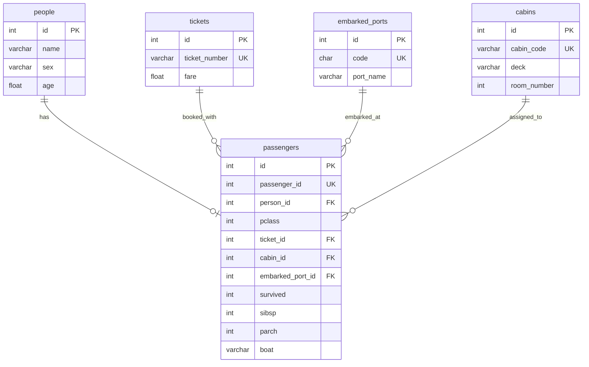

# Titanic ERD

> **적용 범위:** `backend/apps/titanic/models/`  
> **관련 규칙:** [`ENTITY_RULE.md`](ENTITY_RULE.md), [`BACKEND_RULES.md`](BACKEND_RULES.md)  
> **데이터 원본:** `backend/apps/titanic/Titanic-Dataset.csv` (891행)

타이타닉 도메인은 CSV의 단일 승객 행을 **정규화된 5개 테이블**로 나눕니다.  
Mermaid `erDiagram`은 관계 라벨에 **따옴표·괄호·슬래시**를 넣지 않습니다. 상세 설명은 아래 표를 참고하세요.

---

## ERD (Mermaid)



---

## 관계

| From | To | 카디널리티 | 설명 |
|------|-----|-----------|------|
| `people` | `passengers` | 1 : 0..1 | 승객 1명당 인적 정보 1건 (`person_id` → `people.id`) |
| `tickets` | `passengers` | 1 : N | 동일 티켓 번호를 여러 승객이 공유할 수 있음 |
| `embarked_ports` | `passengers` | 1 : N | 승선 항구 (C, Q, S) |
| `cabins` | `passengers` | 1 : N | 객실 배정 (nullable) |

---

## 테이블 정의

### `people` — 인적 정보

| 컬럼       | 타입           | 제약                | 설명                                          |
| -------- | ------------ | ----------------- | ------------------------------------------- |
| `id`     | int          | PK, autoincrement | 시스템 내부 PK ([`ENTITY_RULE`](ENTITY_RULE.md)) |
| `name`   | varchar(255) | NOT NULL          | 승객 이름 (CSV `Name`)                          |
| `gender` | varchar(16)  | NOT NULL          | 성별 (`male` / `female`, CSV `gender`)        |
| `age`    | float        | NULL              | 나이 (CSV `Age`)                              |

### `tickets` — 티켓·운임

| 컬럼 | 타입 | 제약 | 설명 |
|------|------|------|------|
| `id` | int | PK, autoincrement | 시스템 내부 PK |
| `ticket_number` | varchar(64) | UNIQUE, NOT NULL | 티켓 번호 (CSV `Ticket`) |
| `fare` | float | NOT NULL | 운임 (CSV `Fare`) |

### `cabins` — 객실

| 컬럼 | 타입 | 제약 | 설명 |
|------|------|------|------|
| `id` | int | PK, autoincrement | 시스템 내부 PK |
| `cabin_code` | varchar(64) | UNIQUE, NOT NULL | 객실 코드 (CSV `Cabin` 원문) |
| `deck` | varchar(8) | NULL | 객실 앞글자 구역 (예: C23 → `C`) |
| `room_number` | int | NULL | 방 번호 (파싱 가능 시) |

### `embarked_ports` — 승선 항구

| 컬럼 | 타입 | 제약 | 설명 |
|------|------|------|------|
| `id` | int | PK, autoincrement | 시스템 내부 PK |
| `code` | char(1) | UNIQUE, NOT NULL | 항구 코드: `C`, `Q`, `S` (CSV `Embarked`) |
| `port_name` | varchar(64) | NOT NULL | Cherbourg, Queenstown, Southampton |

초기 시드 예시:

| code | port_name |
|------|-----------|
| C | Cherbourg |
| Q | Queenstown |
| S | Southampton |

### `passengers` — 승객·탑승·생존

| 컬럼 | 타입 | 제약 | 설명 |
|------|------|------|------|
| `id` | int | PK, autoincrement | 시스템 내부 PK |
| `passenger_id` | int | UNIQUE, NOT NULL | 데이터셋 승객 번호 (CSV `PassengerId`) |
| `person_id` | int | FK → `people.id` | 인적 정보 |
| `pclass` | int | NOT NULL | 티켓 등급 1·2·3 (CSV `Pclass`) |
| `ticket_id` | int | FK → `tickets.id` | 티켓·운임 |
| `cabin_id` | int | FK → `cabins.id`, NULL | 객실 (없으면 NULL) |
| `embarked_port_id` | int | FK → `embarked_ports.id`, NULL | 승선 항구 |
| `survived` | int | NULL | 0=사망, 1=생존 (CSV `Survived`) |
| `sibsp` | int | NOT NULL | 형제자매·배우자 동승 수 (CSV `SibSp`) |
| `parch` | int | NOT NULL | 부모·자녀 동승 수 (CSV `Parch`) |
| `boat` | varchar(64) | NULL | 탈출 보트 (CSV `Boat`) |

---

## CSV 컬럼 매핑

| CSV 컬럼 | 대상 테이블·컬럼 |
|----------|------------------|
| PassengerId | `passengers.passenger_id` |
| Survived | `passengers.survived` |
| Pclass | `passengers.pclass` |
| Name | `people.name` |
| Sex | `people.sex` |
| Age | `people.age` |
| SibSp | `passengers.sibsp` |
| Parch | `passengers.parch` |
| Ticket | `tickets.ticket_number` |
| Fare | `tickets.fare` |
| Cabin | `cabins.cabin_code` (+ deck/room_number 파싱) |
| Embarked | `embarked_ports.code` |
| Boat | `passengers.boat` |

---

## 구현 상태

| 항목 | 구현 |
|------|------|
| ORM | `titanic/models/tables.py` — `Person`, `Ticket`, `Cabin`, `EmbarkedPort`, `Passenger` |
| 시드 | `TitanicSeedService.seed_from_csv_if_empty()` — 앱 시작 시 CSV → DB (비어 있을 때만) |
| 조회 API | `GET /titanic/data`, `GET /titanic/count` — DB 조인 결과 (CSV 컬럼명 호환) |
| ML 학습 | `JackService` — CSV (`WalterReader`)로 DecisionTree 학습 |
| 레거시 | `titanic_passengers` — 시작 시 DROP, 미사용 |

---

## Cursor 고정 명령어

```text
@docs/DevOps/backend/TITANIC_ERD.md @docs/DevOps/backend/ENTITY_RULE.md

타이타닉 DB는 people, tickets, cabins, embarked_ports, passengers 5테이블 ERD를 따르세요.
PK는 int id 자동증감, FK는 참조 대상을 드러내는 이름을 사용하세요.
```
