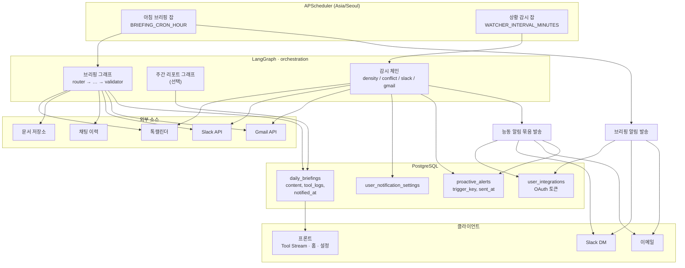

# Moneo 아키텍처

> 면접·협업용 개요 문서. 코드를 열지 않고도 브리핑·능동 알림·연동 구조를 이해할 수 있도록 정리했다.

## 시스템 개요

**Moneo**는 사용자의 **냉장고·날씨·취향** 맥락을 통합해 일상 결정을 돕는 AI 라이프 어시스턴트다.  
핵심 오케스트레이션 축은 **LangGraph 멀티에이전트 브리핑**(매일 아침 업무 요약 사전 생성)과 **상황 감지형 능동 알림**(업무 중 이례적 상황 즉시 통지)이다.  
Slack·Gmail·톡캘린더 연동으로 외부 도구 데이터를 수집하고, 결과는 DB에 저장한 뒤 **웹 Tool Stream** 또는 **Slack DM / 이메일**로 전달한다.

---

## 그래프 아키텍처 (일일 브리핑)

브리핑은 단일 LangGraph 파이프라인으로 실행된다. 노드 순서는 **수집 → 합성 → 검증** 원칙을 따른다.

```
router → calendar → docs → history → slack → gmail → synthesizer → validator
                                                              ↑__________|
                                                         (검증 실패 시 최대 2회)
```

| 노드 | 역할 | 실패·미연동 시 |
|------|------|----------------|
| **router** | Gemini가 브리핑에 넣을 도구 목록 선택 (`calendar`, `docs`, `history`, `slack`, `gmail`) | 파싱 실패 시 전 도구 fallback |
| **calendar** | 톡캘린더 오늘 일정 조회 | `skipped` (연동 off) — 브리핑은 계속 |
| **docs** | 문서 저장소 최근 변경 검색 | `skipped` — 합성 시 문서 언급 생략 |
| **history** | 최근 채팅 이력 요약 | DB 없으면 시뮬레이션 fallback |
| **slack** | Slack digest (멘션·키워드·미응답) | `skipped` — 연동 없으면 자연스럽게 생략 |
| **gmail** | Gmail 미읽음 24h digest | `skipped` — 연동 없으면 자연스럽게 생략 |
| **synthesizer** | 수집 JSON만 근거로 마크다운 브리핑 초안 작성 | Gemini 오류 시 사용자용 오류 문구 |
| **validator** | 초안이 도구 근거와 일치하는지 검사 | 실패 시 synthesizer 재호출 (최대 2회) |

### 왜 이 순서인가

1. **router 먼저** — 불필요한 API 호출을 줄이고, 이후 노드는 `selected_tools`만 실행한다.
2. **도구 노드는 선형 체인** — 각 소스가 독립적이라 병렬보다 단순한 상태 머신이 유지보수에 유리하다. `calendar → docs → history`는 업무 맥락(일정 → 문서 → 대화) 순으로 쌓인다.
3. **slack / gmail은 뒤쪽** — 외부 연동 의존도가 높아 앞단 핵심 소스 실패와 분리한다.
4. **synthesizer → validator 마지막** — 모든 근거가 모인 뒤에만 텍스트를 만들고, 별도 검증자가 품질을 맞춘다 (아래 설계 결정 참고).

주간 리포트는 별도 서브그래프(`weekly_router → aggregate_briefings → risk_analyzer → …`)이며, `daily_briefings` 7일치를 종합한다.

---

## 설계 결정과 이유

### 1. synthesizer와 validator 분리

- **synthesizer**는 “글을 잘 쓰는” 역할, **validator**는 “근거가 맞는지 검사하는” 역할이다.
- 한 모델이 생성과 자기 평가를 동시에 하면 **완료를 과대 보고**하기 쉽다 (환각·문서 인용 오류를 스스로 통과시킴).
- validator 실패 시 `validation_notes`를 붙여 synthesizer를 다시 호출한다. 프론트 **Tool Stream**에는 재시도·실패 이벤트가 모두 노출된다.

### 2. 소스 실패를 `skip`으로 처리

- Slack/Gmail/캘린더를 연동하지 않은 사용자도 **브리핑 전체가 실패하면 안 된다**.
- `status: skipped`는 “오류”가 아니라 “이 소스는 이번 브리핑에서 제외”를 의미한다. synthesizer 프롬프트도 skipped 소스는 언급하지 말라고 명시한다.
- `error`는 API·토큰 등 **복구 가능한 실패**에만 쓴다.

### 3. proactive_alerts 24시간 억제

- 상황 감시 잡은 **30분마다** 돌아가므로, 같은 일정 겹침·같은 Slack 메시지에 반복 알림이 가면 **알림 피로도**가 급증한다.
- `proactive_alerts(user_id, alert_type, trigger_key, sent_at)`에 발송 이력을 남기고, **동일 `trigger_key`는 24시간 내 재발송하지 않는다**.
- 한 주기에 여러 이슈가 감지되면 **개별 푸시 대신 한 메시지로 묶어** 발송한다.

### 4. 아침 브리핑 vs 능동 알림 스케줄러 분리

| 스케줄러 | 트리거 | 목적 |
|----------|--------|------|
| `BRIEFING_CRON_*` | 매일 07:00 (기본, Asia/Seoul) | `daily_briefings` 사전 생성 + 선택적 아침 요약 발송 |
| `WATCHER_*` | `WATCHER_INTERVAL_MINUTES` (기본 30분), 활성 시간대만 | 일정 밀집·겹침·긴급 Slack/메일 감지 |

서로 다른 SLA(정기 요약 vs 즉각 경고)이므로 APScheduler 잡을 분리했다.

---

## 데이터 흐름



### 저장소 요약

| 테이블 | 용도 |
|--------|------|
| `daily_briefings` | 사용자·날짜별 브리핑 본문 + `tool_logs` JSON |
| `user_integrations` | Slack/Gmail OAuth, `metadata.briefing_notify` 등 |
| `user_notification_settings` | 일정 밀집·긴급 메시지 능동 알림 on/off |
| `proactive_alerts` | 능동 알림 발송 이력 (24h 중복 억제) |

---

## API·프론트 경계 (요약)

| 영역 | 대표 경로 |
|------|-----------|
| 오늘 브리핑 | `GET /agent/briefing/today` |
| 주간 리포트 | `POST /agent/report/weekly` |
| 연동 OAuth | `POST /orchestration/integrations/slack|gmail` |
| 브리핑 알림 토글 | `PATCH /orchestration/integrations/briefing-notify` |
| 능동 알림 설정 | `GET/PATCH /orchestration/notification-settings` |

프론트 **Tool Stream**은 브리핑 `tool_logs` 배열을 노드별 `running → success|failed|retrying` 타임라인으로 렌더링한다.

---

## 코드 위치 (빠른 참조)

| 영역 | 경로 |
|------|------|
| 브리핑 그래프 | `backend/apps/orchestration/app/briefing/graph.py` |
| 브리핑 노드 | `backend/apps/orchestration/app/briefing/nodes.py` |
| 소스 어댑터 | `calendar_source.py`, `slack_source.py`, `gmail_source.py` |
| 아침 cron | `backend/apps/orchestration/app/briefing/scheduler.py` |
| 능동 감시 | `backend/apps/orchestration/app/watcher/` |
| 알림 발송 | `backend/apps/orchestration/app/briefing/briefing_notify.py` |
| 프론트 Tool Stream | `frontend/components/home/tool-stream.tsx` |

---

## 환경 변수

운영·로컬 설정은 `backend/.env.example`를 참고한다.  
아래는 브리핑·watcher·연동 관련 항목 요약이다 (값은 플레이스홀더, 시크릿은 Git에 넣지 않는다).

### 일일 브리핑 cron (`briefing/scheduler.py`)

| 변수 | 기본값 | 설명 |
|------|--------|------|
| `BRIEFING_CRON_ENABLED` | `1` | `0`/`false`/`off`/`no` 이면 아침 cron 비활성 |
| `BRIEFING_CRON_HOUR` | `7` | 실행 시(0–23, Asia/Seoul) |
| `BRIEFING_CRON_MINUTE` | `0` | 실행 분(0–59) |

### 상황 감시 watcher (`watcher/scheduler.py`)

| 변수 | 기본값 | 설명 |
|------|--------|------|
| `WATCHER_ENABLED` | `1` | `0`/`false`/`off`/`no` 이면 interval 잡 비활성 |
| `WATCHER_INTERVAL_MINUTES` | `30` | 감시 주기(분, 최소 5) |
| `WATCHER_ACTIVE_HOURS_START` | `8` | 활성 시작 시(KST, 24h) |
| `WATCHER_ACTIVE_HOURS_END` | `20` | 활성 종료 시(이 시각 미만까지) |
| `CALENDAR_DENSITY_THRESHOLD` | `3` | 앞 3시간 내 일정이 이 개수 이상이면 밀집 알림 |

### Slack / Gmail OAuth

| 변수 | 설명 |
|------|------|
| `SLACK_CLIENT_ID` | Slack 앱 Client ID (백엔드) |
| `SLACK_CLIENT_SECRET` | Slack 앱 Client Secret (백엔드만) |
| `GOOGLE_CLIENT_ID` | Google OAuth Web Client ID (Gmail 연동·발송) |
| `GOOGLE_CLIENT_SECRET` | Google OAuth Client Secret (백엔드만) |
| `OAUTH_REDIRECT_ORIGINS` | 허용 callback origin, 쉼표 구분 (예: `http://localhost:3000,https://moneo.choseohee.com`) |

### 프론트 (루트 또는 `frontend/.env.local`)

| 변수 | 설명 |
|------|------|
| `NEXT_PUBLIC_SLACK_CLIENT_ID` | Slack OAuth UI용 (백엔드 `SLACK_CLIENT_ID`와 동일 앱) |
| `NEXT_PUBLIC_GOOGLE_CLIENT_ID` | Google 로그인·Gmail 연동 UI용 |

LLM·DB 등 공통 변수(`GEMINI_API_KEY`, `DATABASE_URL` 등)는 `backend/.env.example` 본문을 따른다.
