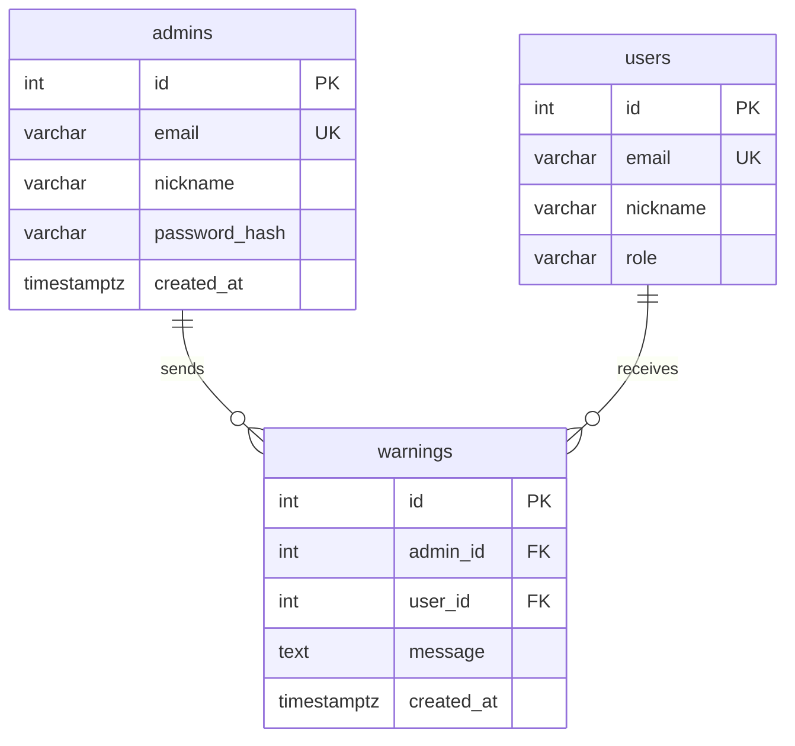

# Lifestyle · Platform ERD

> **적용 범위:** `backend/apps/lifestyle/models/`, `backend/apps/chat/models/`, `backend/apps/admin/`  
> **관련 규칙:** [`ENTITY_RULE.md`](ENTITY_RULE.md), [`BACKEND_RULES.md`](BACKEND_RULES.md)  
> **외부 참조:** `users` (`backend/apps/secom/app/models/user_model.py`)  
> **관리자 상세:** [`ADMIN_ERD.md`](ADMIN_ERD.md) (동일 내용 요약본)

Mermaid `erDiagram`은 **`||--||` `||--o{` `||--o|`** 만 사용합니다 (`}o--||` 는 Obsidian에서 선이 안 그려짐).

---

## 데이터 · 화면 · 역할 매칭 (최종)

| 구분 | 화면명 (UI) | 주 데이터 테이블 | 핵심 역할 |
|------|-------------|------------------|-----------|
| **개인 영역** | 마이페이지 (`/mypage`) | `users` | 본인 정보 확인·프로필 사진 변경·가입 정보 |
| **운영 영역** | 회원 관리 (`/admin`) | `users` | 관리자 — 회원 전수 조회·**경고**·탈퇴 |
| **운영 영역** | 사용자 설정 조회 (`/admin/user-settings`) | `user_settings` | 관리자 — 회원별 AI 모델·말투 등 앱 설정 조회 |

동일 `users` 테이블이 **마이페이지(개인)** 와 **회원 관리(운영)** 에서 역할만 다르게 쓰입니다.  
`user_settings`는 **사용자 설정 조회** 전용이며, 회원 계정·경고와는 분리합니다.

---

## 제품 도메인 (테이블 이름과 다를 수 있음)

| UI·기능 | 역할 | DB 테이블 |
|---------|------|-----------|
| **마이페이지** | 본인 정보·프로필 (`/mypage`) | `users` |
| **회원 관리** | 관리자 — 조회·경고·탈퇴 (`/admin`) | `users` |
| **사용자 설정 조회** | 관리자 — AI 모델·언어 등 앱 설정 | `user_settings` |
| **선호도 설정** | 평소 입는 스타일, 듣는 음악 취향, 못 먹는·알레르기 재료 | `closet`, `music`, `refrigerator` **헤더** (태그·JSON) |
| **옷장** | 날씨·체감온도에 맞는 **복장 추천** (등록 의류 기준) | `closet` + `closet_items` |
| **음악** | 날씨·상황에 맞는 **음악 추천** | `music` + `music_items` |
| **냉장고** | **채팅**으로 음식 추천, **유통기한** 임박 재료 안내 | `refrigerator` + `refrigerator_items` + `chat_sessions` → `messages` |
| **관리자 계정** | `/admin/login` (`admin_access_token` 분리) | `admins` → `warnings` ← `users` |

---

## 대시보드 카테고리 ↔ ERD

| 카테고리            | 테이블                                                 | 설명                          |
| --------------- | --------------------------------------------------- | --------------------------- |
| **관리자**         | `admins`, `warnings`                                | `/admin` 로그인·경고 발송          |
| **회원·운영**       | `users`                                             | 마이페이지(개인) · 회원 관리(운영)   |
| **사용자 설정 조회**  | `user_settings`                                     | 관리자 — AI 모델·언어 등 앱 설정     |
| **선호도 (헤더)**    | `closet`, `music`, `refrigerator`                   | 스타일·장르·기피 재료 등 **취향 프로필**   |
| **라이프스타일 (상세)** | `closet_items`, `refrigerator_items`, `music_items` | 의류·식재료·저장곡                  |
| **채팅**          | `chat_sessions` → `messages`                        | 대화 (냉장고·음식 추천 등에 사용)        |

---

## ERD — 회원·앱 설정 (`users` + `user_settings`)

`users`는 **마이페이지(개인)** 와 **회원 관리(운영)** 에 공통으로 쓰입니다.  
`user_settings`는 **사용자 설정 조회(운영)** 전용 — 회원별 UI 언어·선호 AI 모델을 담습니다.

```mermaid
erDiagram
    users ||--|| user_settings : app_and_ai

    users {
        int id PK
        varchar email UK
        varchar nickname
        varchar role
        varchar password_hash
        timestamptz created_at
        varchar profile_image_url
    }

    user_settings {
        int id PK
        int user_id FK UK
        varchar language
        varchar preferred_model
        timestamptz created_at
        timestamptz updated_at
    }
```

---

## ERD — 관리자 (`admins` · `warnings` · `users`)

`warnings`가 **admins ↔ users 교차 엔티티**입니다. `/admin`에서 회원(`users`) 조회·탈퇴·경고를 처리합니다.



| 기능 | API |
|------|-----|
| 관리자 로그인 | `POST /admin/login` |
| 회원 목록·탈퇴 | `GET/DELETE /admin/users/*` |
| 경고 발송 | `POST /admin/users/{id}/warnings` |
| 사용자 설정 조회 | `GET /admin/user-settings` |
| 경고 조회 (회원) | `GET /auth/warnings` |

코드: `backend/apps/admin/`, UI: `frontend/app/admin/`

---

## ERD — 선호도 · 라이프스타일 · 채팅

`users` 아래 **선호도 헤더** → **기능용 아이템** → 필요 시 **채팅** 흐름입니다.

```mermaid
erDiagram
    closet ||--|| users : taste_for_outfit
    music ||--|| users : taste_for_music
    refrigerator ||--|| users : taste_for_food
    users ||--o{ chat_sessions : chats

    closet ||--o{ closet_items : wardrobe
    music ||--o{ music_items : saved_tracks
    refrigerator ||--o{ refrigerator_items : stock
    chat_sessions ||--o{ messages : messages

    closet {
        int id PK
        int user_id FK UK
        varchar gender_preset
        json style_tags
        varchar temperature_sensitivity
        timestamptz created_at
        timestamptz updated_at
    }

    closet_items {
        int id PK
        int user_id FK
        varchar name
        varchar category
        varchar warmth
        varchar color
        varchar note
        timestamptz created_at
    }

    refrigerator {
        int id PK
        int user_id FK UK
        json avoided_ingredients
        json cooking_preference_tags
        timestamptz created_at
        timestamptz updated_at
    }

    refrigerator_items {
        int id PK
        int user_id FK
        varchar name
        varchar quantity
        date expiry_date
        varchar category
        varchar note
        timestamptz created_at
    }

    music {
        int id PK
        int user_id FK UK
        json genre_tags
        json mood_tags
        timestamptz created_at
        timestamptz updated_at
    }

    music_items {
        int id PK
        int user_id FK
        varchar title
        varchar artist
        varchar scene
        varchar note
        timestamptz created_at
    }

    chat_sessions {
        int id PK
        int user_id FK
        varchar title
        timestamptz created_at
        timestamptz updated_at
    }

    messages {
        int id PK
        int session_id FK
        varchar role
        text content
        timestamptz created_at
    }
```

### 헤더 vs 아이템 (같은 기능, 다른 층)

| 기능 | 선호도·프로필 (헤더) | 실행·추천 데이터 (아이템) |
|------|---------------------|---------------------------|
| 옷장 | `closet` — 스타일 태그, 체감온도 | `closet_items` — 보유 의류 → **날씨 맞춤 추천** |
| 음악 | `music` — 장르·무드 | `music_items` — 저장곡 → **날씨·상황 추천** |
| 냉장고 | `refrigerator` — 기피·알레르기·요리 성향 | `refrigerator_items` — 재고·유통기한 → **채팅 음식 추천·만료 알림** |

---

## 관계

### 앱·AI 설정

| 부모 | 자식 | 카디널리티 | 설명 |
|------|------|-----------|------|
| `users` | `user_settings` | 1 : 1 | **사용자 설정 조회** — UI 언어, 선호 AI 모델 |

### 선호도 헤더 (`users` 직속, 1:1)

| 테이블 | 제품 의미 |
|--------|-----------|
| `closet` | 선호 복장·체감온도 (추천 시 컨텍스트) |
| `music` | 선호 장르·무드 |
| `refrigerator` | 못 먹는 것·알레르기·요리 성향 |

### 라이프스타일 상세 (헤더 → N)

| 부모 | 자식 | 카디널리티 | 제품 의미 |
|------|------|-----------|-----------|
| `closet` | `closet_items` | 1 : N | 등록 의류, 날씨 추천 소스 |
| `music` | `music_items` | 1 : N | 상황별 저장곡, 추천 소스 |
| `refrigerator` | `refrigerator_items` | 1 : N | 유통기한·재고 |
| `users` | `chat_sessions` | 1 : N | 채팅방 (냉장고 음식 추천 등) |
| `chat_sessions` | `messages` | 1 : N | 대화 (`session_id` FK) |

### DB FK vs 다이어그램

| 테이블 | 물리 FK | 다이어그램 부모 | 비고 |
|--------|---------|----------------|------|
| `user_settings` | `user_id` → `users` | `users` | **사용자 설정 조회** 도메인 |
| `closet` / `music` / `refrigerator` | `user_id` → `users` | `users` | 선호도 헤더 |
| `*_items` | `user_id` → `users` | 각 헤더 | 헤더 FK 컬럼 없음 → UI·도메인 계층 |
| `messages` | `session_id` → `chat_sessions` | `chat_sessions` | 물리 FK 일치 |
| `admins` | — | (독립 행) | `users`와 직접 FK 없음, 시스템 1명 |
| `warnings` | `admin_id` → `admins`, `user_id` → `users` | `admins` + `users` | **교차** — 누가 누구에게 경고 |

### 관리자

| 부모 | 자식 | 카디널리티 | 설명 |
|------|------|-----------|------|
| — | `admins` | 1행 (시드) | `admin@gmail.com`, `/admin/login` |
| `admins` | `warnings` | 1 : N | 발신 관리자 (`admin_id`) |
| `users` | `warnings` | 1 : N | 수신 회원 (`user_id`, `role=user`만) |

---

## 테이블 정의

### `users` — 회원 (secom)

| 컬럼 | 타입 | 제약 | 설명 |
|------|------|------|------|
| `id` | int | PK, autoincrement | 시스템 내부 PK |
| `email` | varchar(255) | UNIQUE | 로그인 이메일 |
| `nickname` | varchar(32) | NOT NULL | 표시 이름 |
| `role` | enum | NOT NULL | `user` 권장 (`admin`은 레거시, `admins` 테이블 사용) |
| `password_hash` | varchar(255) | NOT NULL | 비밀번호 해시 |
| `created_at` | timestamptz | NULL | 가입 시각 |
| `profile_image_url` | varchar(512) | NULL | 프로필 이미지 |

### `user_settings` — 사용자 설정 조회 (AI·언어 설정)

| 컬럼 | 타입 | 제약 | 설명 |
|------|------|------|------|
| `id` | int | PK, autoincrement | 시스템 내부 PK |
| `user_id` | int | FK → `users.id`, UNIQUE, CASCADE | 소유 사용자 |
| `language` | varchar(16) | NOT NULL, default `ko` | UI·응답 언어 |
| `preferred_model` | varchar(64) | default `gemini-2.5-flash-lite` | 선호 Gemini 모델 |
| `created_at` | timestamptz | server default NOW() | 생성 시각 |
| `updated_at` | timestamptz | on update | 수정 시각 |

### `closet` — 선호도(복장) + 추천 컨텍스트

| 컬럼 | 타입 | 제약 | 설명 |
|------|------|------|------|
| `id` | int | PK, autoincrement | 시스템 내부 PK |
| `user_id` | int | FK → `users.id`, UNIQUE, CASCADE | 소유 사용자 |
| `gender_preset` | varchar(16) | NOT NULL, default `unisex` | `male`, `female`, `unisex` |
| `style_tags` | json | NULL | 평소 선호 스타일 태그 |
| `temperature_sensitivity` | varchar(16) | NOT NULL, default `normal` | 체감온도 (날씨 추천용) |
| `created_at` | timestamptz | server default | 생성 시각 |
| `updated_at` | timestamptz | on update | 수정 시각 |

### `closet_items` — 보유 의류 (날씨 맞춤 추천)

| 컬럼 | 타입 | 제약 | 설명 |
|------|------|------|------|
| `id` | int | PK, autoincrement | 시스템 내부 PK |
| `user_id` | int | FK → `users.id`, CASCADE, index | 소유 사용자 |
| `name` | varchar(64) | NOT NULL | 의류 이름 |
| `category` | varchar(32) | default `top` | `top`, `bottom`, `outer` 등 |
| `warmth` | varchar(16) | default `mid` | `light`, `mid`, `heavy` |
| `color` | varchar(32) | NULL | 색상 |
| `note` | varchar(128) | NULL | 메모 |
| `created_at` | timestamptz | server default | 생성 시각 |

### `refrigerator` — 선호도(식단·기피) + 채팅 추천 컨텍스트

| 컬럼 | 타입 | 제약 | 설명 |
|------|------|------|------|
| `id` | int | PK, autoincrement | 시스템 내부 PK |
| `user_id` | int | FK → `users.id`, UNIQUE, CASCADE | 소유 사용자 |
| `avoided_ingredients` | json | NULL | 못 먹는·알레르기 재료 |
| `cooking_preference_tags` | json | NULL | 요리 성향 태그 |
| `created_at` | timestamptz | server default | 생성 시각 |
| `updated_at` | timestamptz | on update | 수정 시각 |

### `refrigerator_items` — 재고·유통기한

| 컬럼 | 타입 | 제약 | 설명 |
|------|------|------|------|
| `id` | int | PK, autoincrement | 시스템 내부 PK |
| `user_id` | int | FK → `users.id`, CASCADE, index | 소유 사용자 |
| `name` | varchar(64) | NOT NULL | 식재료 이름 |
| `quantity` | varchar(32) | NULL | 수량 표기 |
| `expiry_date` | date | NULL, index | 유통기한 |
| `category` | varchar(32) | NULL | 분류 |
| `note` | varchar(128) | NULL | 메모 |
| `created_at` | timestamptz | server default | 생성 시각 |

### `music` — 선호도(장르·무드) + 추천 컨텍스트

| 컬럼 | 타입 | 제약 | 설명 |
|------|------|------|------|
| `id` | int | PK, autoincrement | 시스템 내부 PK |
| `user_id` | int | FK → `users.id`, UNIQUE, CASCADE | 소유 사용자 |
| `genre_tags` | json | NULL | 선호 장르 |
| `mood_tags` | json | NULL | 선호 무드 |
| `created_at` | timestamptz | server default | 생성 시각 |
| `updated_at` | timestamptz | on update | 수정 시각 |

### `music_items` — 저장 곡 (날씨·상황 추천)

| 컬럼 | 타입 | 제약 | 설명 |
|------|------|------|------|
| `id` | int | PK, autoincrement | 시스템 내부 PK |
| `user_id` | int | FK → `users.id`, CASCADE, index | 소유 사용자 |
| `title` | varchar(128) | NOT NULL | 곡 제목 |
| `artist` | varchar(64) | NULL | 아티스트 |
| `scene` | varchar(16) | NOT NULL, default `commute`, index | `commute`, `outing`, `cooking` 등 |
| `note` | varchar(128) | NULL | 메모 |
| `created_at` | timestamptz | server default | 생성 시각 |

### `chat_sessions` — 채팅 세션

| 컬럼 | 타입 | 제약 | 설명 |
|------|------|------|------|
| `id` | int | PK, autoincrement | 시스템 내부 PK |
| `user_id` | int | FK → `users.id`, CASCADE, index | 소유 사용자 |
| `title` | varchar(128) | default `새 대화` | 세션 제목 |
| `created_at` | timestamptz | server default | 생성 시각 |
| `updated_at` | timestamptz | on update | 수정 시각 |

### `messages` — 메시지

| 컬럼 | 타입 | 제약 | 설명 |
|------|------|------|------|
| `id` | int | PK, autoincrement | 시스템 내부 PK |
| `session_id` | int | FK → `chat_sessions.id`, CASCADE, index | 소속 세션 |
| `role` | enum | NOT NULL | `user`, `assistant`, `system` |
| `content` | text | NOT NULL | 메시지 본문 |
| `created_at` | timestamptz | server default | 생성 시각 |

### `admins` — 시스템 관리자 (admin)

| 컬럼 | 타입 | 제약 | 설명 |
|------|------|------|------|
| `id` | int | PK, autoincrement | 관리자 PK (시드 시 1 기대) |
| `email` | varchar(255) | UNIQUE | `admin@gmail.com` |
| `nickname` | varchar(32) | NOT NULL | 표시 이름 |
| `password_hash` | varchar(255) | NOT NULL | 비밀번호 해시 |
| `created_at` | timestamptz | NULL | 생성 시각 |

### `warnings` — 경고 (`admins` → `users` 교차)

| 컬럼 | 타입 | 제약 | 설명 |
|------|------|------|------|
| `id` | int | PK, autoincrement | 경고 PK |
| `admin_id` | int | FK → `admins.id`, CASCADE, index | 발신 관리자 |
| `user_id` | int | FK → `users.id`, CASCADE, index | 대상 회원 |
| `message` | text | NOT NULL | 경고 내용 |
| `created_at` | timestamptz | NULL | 발송 시각 |

---

## 구현 상태

| 항목 | 구현 |
|------|------|
| ORM | `lifestyle/`, `chat/`, `admin/app/models/` |
| API | `/platform/*`, 채팅 API, `/admin/login`, `/admin/users/*` |
| 개요 | `GET /platform/overview` (`user_settings` = **사용자 설정 조회**, `users` = **회원·운영**) |
| 관리자 시드 | `main.py` lifespan → `AdminService.ensure_admin_account()` |

---

## Cursor 고정 명령어

```text
@docs/DevOps/backend/LIFESTYLE_ERD.md @docs/DevOps/backend/ENTITY_RULE.md

users = 마이페이지(개인) + 회원 관리(운영, /admin). user_settings = 사용자 설정 조회(운영).
선호도 = closet/music/refrigerator 헤더. admin: admins + warnings. warnings는 admin_id+user_id 교차.
```
